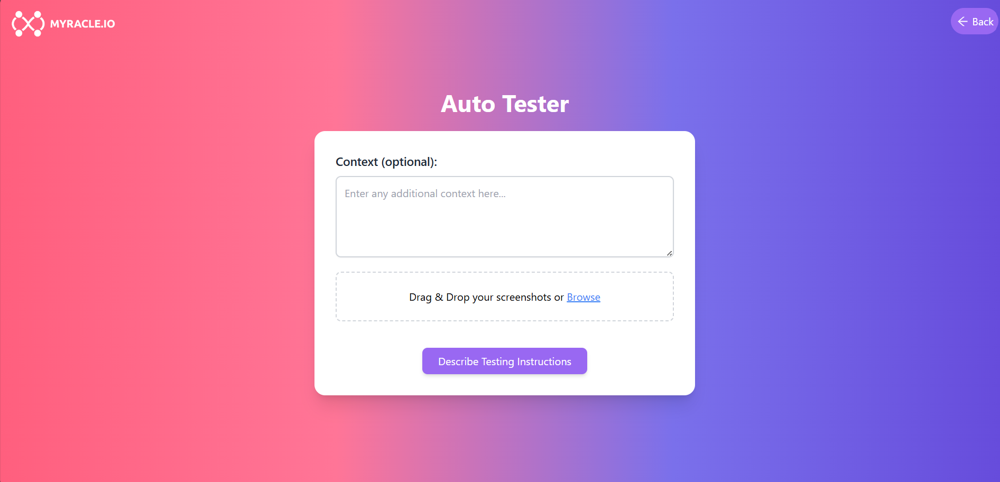
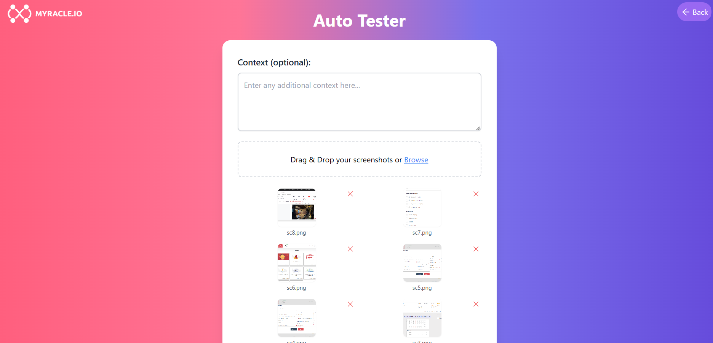
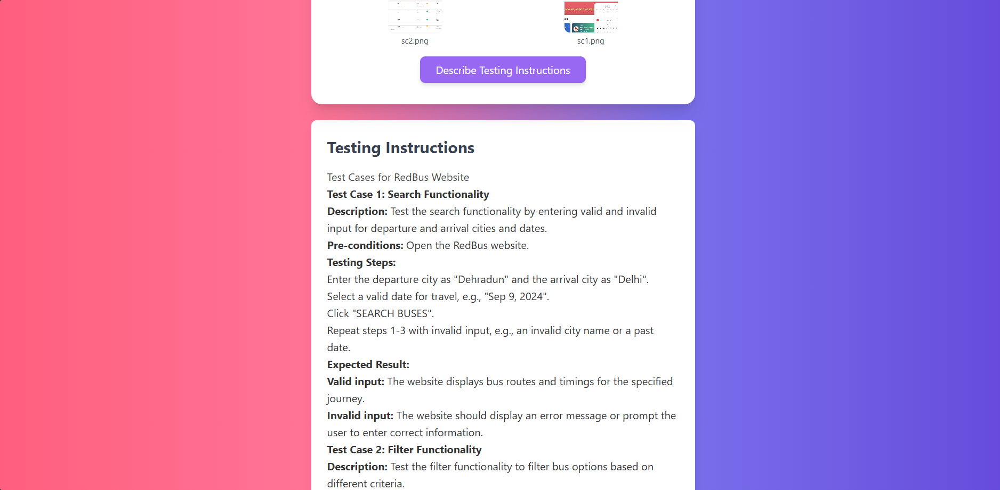

# Auto Tester - Multimodal Test Case Generator

Auto Tester is a web application designed to generate detailed test cases based on uploaded screenshots of a user interface, with optional context provided by the user. The system uses Google Generative AI to analyze images and generate comprehensive testing instructions for each visual feature present in the screenshots.



## Features

- **Upload Multiple Screenshots**: Drag and drop multiple screenshots to generate test cases based on the visual elements in each image.
- **Context Input**: Provide optional context to refine the test cases generated for your specific requirements.
- **Detailed Testing Instructions**: Receive comprehensive, step-by-step test cases for each uploaded screenshot, including descriptions, pre-conditions, testing steps, and expected results.

## Screenshots

### Initial UI Layout


### Generated Test Cases Example




## Installation and Setup

To run the project locally, follow the steps below:

### 1. Clone the Repository

Clone this repository to your local machine using the following command:

```bash
git clone https://github.com/anuni03/Auto-Tester.git
cd Auto-Tester
```

### 2. Setup the Frontend (Client)

```bash
cd client
npm install
npm start
```

This will start the frontend server on http://localhost:3000

### 3. Setup the Backend (Server)

```bash
cd server
npm install
npm start
```

This will start the backend server on http://localhost:5000.

# Usage

Upload Screenshots: Drag and drop your screenshots into the designated area on the frontend.

Provide Context: Optionally, add context that can help refine the generated test cases.

Generate Test Cases: Click on the "Describe Testing Instructions" button to receive detailed test cases.

# Project Structure

client/: Contains the frontend code, including React components and styling.
server/: Contains the backend code, which handles image processing and communicates with the Google Generative AI API.

# Prompts Strategy

The project uses a structured prompt strategy to guide the AI in generating relevant test cases. Each prompt includes a description of the task, the uploaded images, and any additional context provided by the user. This strategy ensures that the generated test cases are comprehensive, specific, and tailored to the visual features present in the screenshots.

# Dependencies

Frontend: React, React Dropzone, React Markdown, Material-UI
Backend: Express, Multer, Google Generative AI, dotenv, CORS
